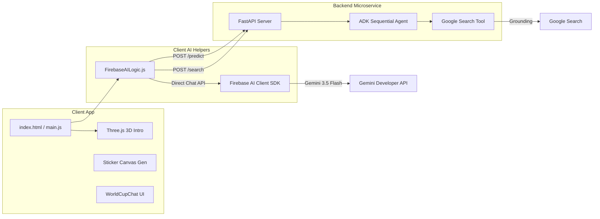

# 🏆 FIFA World Cup 2026 Interactive Hub (WebGL & AI)

Welcome to the **FIFA World Cup 2026 Interactive Hub** — a cutting-edge web portal that features interactive WebGL graphics (Three.js), AI-driven tournament match forecasting, a personalized holographic sticker generator (Gemini Image API), and a conversational assistant with grounding (Google Search).

---

## System Architecture

The project consists of a client-side web application and a dedicated AI microservice.



---

## Key Features

1.  **WebGL Intro**: A premium animated soccer ball entering a night-lit stadium field.
2.  **Groups & Bracket Standings**: Live standings table with real-time browser timezone calculations (so game times adapt to the user's location).
3.  **AI Analyst Predictions**: Sequential Multi-agent workflow investigating H2H, recent form, and news before returning 3 detailed score options and probability charts.
4.  **Sticker Generator**: Transform user photographs into vintage holographic player cards with detailed stats generated by AI.
5.  **Multi-Language Engine**: Seamless instant English/Spanish switcher (adjusts static layouts, date structures, chat prompts, and system prompts on the fly).
6.  **Secure Config**: Zero hardcoded secrets, using client-side and server-side environmental setups.

---

## Directory Structure

```
world-cup-app/
├── analyst_service/        # Python FastAPI AI Microservice (ADK Agents)
│   ├── app/                # Modular agent & schema configurations
│   └── main.py             # Server runner entrypoint
├── src/                    # Frontend SPA Codebase
│   ├── domain/             # Domain entity models (Match, Team, Sticker, Prediction)
│   ├── infrastructure/     # External adapters and cross-cutting concerns
│   │   ├── ai/             # FirebaseAILogic, WinnerAnimationTrigger
│   │   ├── db/             # DataLoader for local JSON schedules
│   │   ├── lang/           # TranslationDict, LocalizationService
│   │   ├── media/          # CameraService (webcam access)
│   │   ├── search/         # NLPQueryParser
│   │   ├── utils/          # TimezoneUtil and shared helpers
│   │   └── AppConfig.js    # Environment-based configuration
│   ├── resources/          # Static assets & StickerCardRenderer canvas helper
│   ├── ui/                 # View components & CSS animations
│   └── main.js             # Client bootstrap
├── resources/              # Static tournament data (JSON match schedules)
├── tests/                  # Automated test suites
│   └── unit/               # Unit tests (e.g. test_standings.js)
├── index.html              # Main web portal structure
├── package.json            # Node dev scripts (Vite build)
└── .env                    # System environment credentials
```

---

## Local Setup & Quickstart

### 1. Environment Configuration
Copy `.env.example` in both root and `analyst_service` to `.env` and fill in your Firebase/Google Cloud credentials:
```bash
cp .env.example .env
cp analyst_service/.env.example analyst_service/.env
```

### 2. Run the Backend Microservice
Navigate to `analyst_service/`, install dependencies with `uv`, and start:
```bash
cd analyst_service
uv pip install -r pyproject.toml
./run_local.sh
```

### 3. Run the Frontend App
Navigate to the root directory, install npm packages, and spin up the Vite development server:
```bash
npm install
npm run dev
```

Open `http://localhost:5173` in your browser to interact with the hub!
