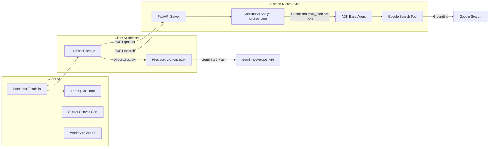

# 🏆 FIFA World Cup 2026 Interactive Hub (WebGL & AI)

Welcome to the **FIFA World Cup 2026 Interactive Hub** — a cutting-edge web portal that features interactive WebGL graphics (Three.js), AI-driven tournament match forecasting, a personalized holographic sticker generator (Gemini Image API), and a conversational assistant with grounding (Google Search).

---

## System Architecture

The project consists of a client-side web application and a dedicated AI microservice.



---

## Key Features

1.  **WebGL Intro**: A premium animated soccer ball entry featuring a holographic tactical grid pitch, glowing cyan energy core inside the sphere, PointLight path tracking, procedural orbital ring rotations, and a dramatic camera shake impact on goal.
2.  **Groups & Bracket Standings**: Live standings tables and knockout stages with real-time browser timezone conversion and fully responsive popups (featuring dynamic max-height constraints and internal scrolling).

------


-------


------

3.  **Group Stage Contextual Predictions**: Match research reports and predictions now incorporate live World Cup group standings, previous group match outcomes, competitor scores, and qualification scenarios/mathematics (e.g., must-win pressure, draw scenarios).
4.  **Conditional Critic Evaluator Pattern**: The backend prediction agent uses a custom `ConditionalAnalystOrchestrator`. If the candidate prediction is doubtful (maximum probability scenario is `0.40` or lower), it automatically runs a critique and refinement loop using a `critic_agent` and `refiner_agent`.

-----


-----

5.  **Firebase Analytics Integration**: Automatically tracks web client user interaction events including:
    - `screen_view` (tab navigation views)
    - `request_ai_analysis` (match AI analysis requests)
    - `save_prediction` (predictions saved in local history)
    - `generate_sticker` (player cards generated)
    - `chat_initialized` and `chat_message_sent` (conversational assistant usage)
6.  **Sticker Generator**: Transforms user photographs into holographic player cards with dynamically assigned jersey numbers based on position (DEF=2, MED=10, DEL=9, POR=1) and customizable role titles/icons (DEF="Leñador" with shield, MED="Crack" with magic spark, DEL="Goleador" with goal net, POR="Atajador" with gloves) with high-fidelity face mapping.

-----


-----


-----

7.  **Conversational Chat IA**: A real-time chat powered by Firebase AI with an amber discoverability pulse indicator in the navigation tab bar (designed to fit perfectly on mobile screens in a single row).
8.  **Secure Config & State**: Zero hardcoded secrets, utilizing environment-based variables, and persistent long-term storage in the Vertex AI Memory Bank via automatic callback hooks.

-----


-----

## Directory Structure

```
world-cup-app/
├── analyst_service/        # Python FastAPI AI Microservice (ADK Agents)
│   ├── app/                # Modular agent & schema configurations
│   │   ├── agents/         # Researcher, Critic, Refiner, Orchestrator, & Memory config
│   │   └── api/            # Router and endpoint handlers
│   └── main.py             # Server runner entrypoint
├── src/                    # Frontend SPA Codebase
│   ├── domain/             # Domain entity models (Match, Team, Sticker, Prediction)
│   ├── infrastructure/     # External adapters and cross-cutting concerns
│   │   ├── firebase/       # FirebaseClient (App, Analytics, and Gemini AI init)
│   │   ├── ai/             # WinnerAnimationTrigger
│   │   ├── db/             # DataLoader for local JSON schedules
│   │   ├── lang/           # TranslationDict, LocalizationService
│   │   ├── media/          # CameraService (webcam access)
│   │   ├── search/         # NLPQueryParser
│   │   ├── utils/          # TimezoneUtil and shared helpers
│   │   └── AppConfig.js    # Environment-based configuration
│   ├── resources/          # Static assets & StickerCardRenderer canvas helper
│   ├── ui/                 # View components & CSS animations
│   └── main.js             # Client bootstrap
├── resources/              # Static tournament data (JSON match schedules)
├── tests/                  # Automated test suites
│   └── unit/               # Unit tests (e.g. test_standings.js)
├── index.html              # Main web portal structure
├── package.json            # Node dev scripts (Vite build)
└── .env                    # System environment credentials
```

---

## Local Setup & Quickstart

### 1. Environment Configuration
Copy `.env.example` in both root and `analyst_service` to `.env` and fill in your Firebase/Google Cloud credentials:
```bash
cp .env.example .env
cp analyst_service/.env.example analyst_service/.env
```

### 2. Run the Backend Microservice
Navigate to `analyst_service/`, install dependencies with `uv`, and start:
```bash
cd analyst_service
uv pip install -r pyproject.toml
./run_local.sh
```

### 3. Run the Frontend App
Navigate to the root directory, install npm packages, and spin up the Vite development server:
```bash
npm install
npm run dev
```

Open `http://localhost:5173` in your browser to interact with the hub!
