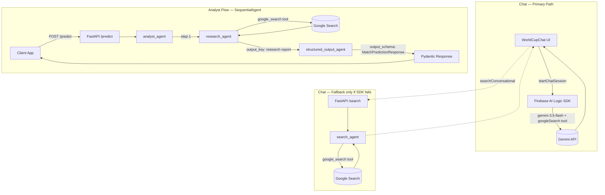

# FIFA World Cup 2026 AI Analyst Microservice

This microservice provides AI-driven football predictions, historical matchup analysis, and conversational search capability specifically scoped to the FIFA World Cup. It is built using **FastAPI** and the **Google Agent Development Kit (ADK)**.

---

## Architecture & Workflow

The microservice uses a modular structure separating network routing from agent logic.



---

## Directory Structure

Following software engineering best practices, the codebase is separated into clean packages:

```
analyst_service/
├── app/
│   ├── core/                  # Core configurations & environments
│   ├── schemas/               # API schemas & data structures
│   │   └── prediction.py      # Match prediction response schemas
│   ├── agents/                # AI Agents definitions
│   │   ├── researcher.py      # Researcher agent (queries Google Search for matchup facts & underdog conditions)
│   │   ├── analyst.py         # Analyst agent (formats structured outcomes at temperature 1.0 with high-unpredictability/surprise guidelines)
│   │   └── search.py          # Conversational World Cup Search assistant (Google Search fallback grounding)
│   └── api/                   # Router and endpoint logic
│       └── endpoints.py       # FastAPI handlers
├── main.py                    # Root entrypoint wrapper for Docker/Uvicorn
├── agent.py                   # Proxy for backwards compatibility
└── pyproject.toml             # Python project dependencies
```

---

## API Endpoints

### 1. Health Check
*   **Method**: `GET`
*   **Path**: `/health` (or `/`)
*   **Response**:
    ```json
    {"status": "healthy", "service": "FIFA World Cup 2026 AI Analyst Microservice"}
    ```

### 2. Match Prediction
*   **Method**: `POST`
*   **Path**: `/predict`
*   **Headers**: `Content-Type: application/json`
*   **Payload**:
    ```json
    {
      "match_id": "wc2026_gA_m01",
      "home_team": "México",
      "away_team": "República Checa",
      "language": "es"
    }
    ```
*   **Response**: A structured JSON object containing H2H records, recent form list, suggested outcomes, and exactly three detailed score scenarios.

### 3. World Cup Chat Search
*   **Method**: `POST`
*   **Path**: `/search`
*   **Headers**: `Content-Type: application/json`
*   **Payload**:
    ```json
    {
      "query": "Who won the World Cup in 2010?",
      "language": "en"
    }
    ```
*   **Response**: A markdown text containing the verified World Cup information.

---

## Local Development Setup

Ensure you have **uv** installed. Configure environment variables in `.env` (refer to `.env.example`).

1.  **Install dependencies**:
    ```bash
    uv pip install -r pyproject.toml
    ```
2.  **Run locally**:
    ```bash
    ./run_local.sh
    ```
    The service will start at `http://localhost:8000`.
