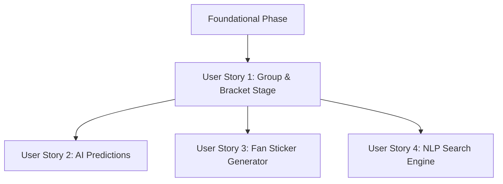

# Tasks: World Cup 2026 Web Application

**Input**: Design documents from `/specs/001-tournament-app-features/`
**Prerequisites**: plan.md (required), spec.md (required for user stories), research.md, data-model.md, contracts/

## Format: `[ID] [P?] [Story] Description`

- **[P]**: Can run in parallel (different files, no dependencies)
- **[Story]**: Which user story this task belongs to (e.g., US1, US2, US3, US4)
- Include exact file paths in descriptions

---

## Phase 1: Setup (Shared Infrastructure)

**Purpose**: Project initialization and basic structure.

- [X] T001 Create project structure directories under `src/` (domain, infrastructure, ui)
- [X] T002 Initialize npm project and install packages `three`, `gsap`
- [X] T003 [P] Configure linting, formatting, and standard configuration files

---

## Phase 2: Foundational (Blocking Prerequisites)

**Purpose**: Core infrastructure that MUST be complete before ANY user story can be implemented.

**⚠️ CRITICAL**: No user story work can begin until this phase is complete.

- [X] T004 Set up dataset loader to read JSON tournament files from `resources/` directory
- [X] T005 [P] Implement base database listener class under `src/infrastructure/db/FirebaseService.js`
- [X] T006 Implement environment config utility under `src/infrastructure/config.js`
- [X] T007 Initialize base styles and configurations under `src/ui/index.css`

**Checkpoint**: Foundation ready - user story implementation can now begin in parallel.

---

## Phase 3: User Story 1 - Dynamic Group Stage & Bracket Visualizations (Priority: P1) 🎯 MVP

**Goal**: Render group stage standings (A–L), filter matches, and present an interactive 3D waving flag and bracket view using Three.js and GSAP.

**Independent Test**: Seed matches, verify navigation and standings computation, and check WebGL renderer renders dynamic flag textures.

- [X] T008 [P] [US1] Define Team entity and Group Standing calculator under `src/domain/entities/Team.js`
- [X] T009 [P] [US1] Define Match entity under `src/domain/entities/Match.js`
- [X] T010 [P] [US1] Create WebGL canvas helper under `src/ui/components/WebGLCanvas.js`
- [X] T011 [US1] Implement 3D Scene Manager under `src/ui/animations/SceneManager.js`
- [X] T012 [US1] Implement flag waving shaders and mesh generation under `src/ui/animations/FlagFactory.js`
- [X] T013 [US1] Implement interaction controller linking DOM events to 3D triggers under `src/ui/animations/InteractionManager.js`
- [X] T014 [US1] Create Group Stage standings UI grid under `src/ui/components/GroupStandings.js`
- [X] T015 [US1] Create Knockout Stage bracket view under `src/ui/components/KnockoutBracket.js`
- [X] T016 [US1] Implement stage transition camera movements under `src/ui/animations/CameraTransitions.js`

**Checkpoint**: User Story 1 is fully functional and testable independently.

---

## Phase 4: User Story 2 - AI Match Prediction Assistant ("Consult the Analyst") (Priority: P2)

**Goal**: Request matchup predictions, render form analysis, and provide one-click auto-fill for prediction inputs.

**Independent Test**: Load upcoming matches, click prediction assistant, verify modal window renders correct metrics, and apply suggestion.

- [X] T017 [P] [US2] Define Prediction and Analysis entities under `src/domain/entities/Prediction.js`
- [X] T018 [US2] Implement Gemini AI Analyst connector under `src/infrastructure/ai/FirebaseAILogic.js`
- [X] T019 [US2] Create Prediction input form under `src/ui/components/PredictionForm.js`
- [X] T020 [US2] Create Analyst suggestions panel modal under `src/ui/components/AnalystModal.js`
- [X] T021 [US2] Link AI completions to 3D flag animation highlights under `src/infrastructure/ai/AnimationTrigger.js`

**Checkpoint**: User Stories 1 AND 2 are functional and work together.

---

## Phase 5: User Story 3 - Personalized Digital Team Sticker (Priority: P3)

**Goal**: Allow fans to upload or capture photos, overlay national crests and flags, render a rotating 3D preview card, and download the sticker.

**Independent Test**: Select national team, upload image, preview rotating card, and trigger download.

- [X] T022 [P] [US3] Define Sticker entity under `src/domain/entities/Sticker.js`
- [X] T023 [US3] Implement client-side camera capture controller under `src/infrastructure/media/CameraService.js`
- [X] T024 [US3] Implement image overlay and canvas processing under `src/resources/foto-card.js`
- [X] T025 [US3] Renders dynamic 3D sticker card preview mesh under `src/ui/animations/StickerCardPreview.js`
- [X] T026 [US3] Create Sticker view layout screen under `src/ui/views/StickerView.js`

**Checkpoint**: User Stories 1, 2, and 3 are functional.

---

## Phase 6: User Story 4 - Natural Language Statistical Search Engine (Priority: P4)

**Goal**: Accept colloquial input text, compile structured data response tables, and highlight match profiles.

**Independent Test**: Issue queries like "Which forwards under 23 have scored in Estadio Azteca" and verify correct response layout loads.

- [X] T027 [US4] Implement NLP search processing client service under `src/infrastructure/search/NLPQueryParser.js`
- [X] T028 [US4] Create Search Input component with dynamic placeholders under `src/ui/components/SearchBar.js`
- [X] T029 [US4] Create structured search results grid displaying players and matches under `src/ui/components/SearchResults.js`

---

## Phase 7: Polish & Cross-Cutting Concerns

**Purpose**: Visual optimizations, asset preloading, performance tuning, and localization.

- [X] T030 [P] Implement English/Spanish translation maps under `src/resources/translations.json`
- [X] T031 Implement dynamic localization controller under `src/infrastructure/LocalizationService.js`
- [X] T032 Optimize Three.js rendering loops to pause on inactive tabs/frames to protect INP

---

## Dependencies & Execution Order

### Phase Dependencies

- **Setup (Phase 1)**: Can start immediately.
- **Foundational (Phase 2)**: Depends on Setup completion. Blocks all user stories.
- **User Stories (Phase 3+)**: All depend on Foundational completion.
- **Polish (Phase 7)**: Depends on all user stories being complete.

### User Story Dependencies



### Parallel Opportunities

- Setup tasks `T001` through `T003` can run in parallel.
- Entities `T008` and `T009` under User Story 1 can be developed in parallel.
- Once User Story 1 finishes, work on predictions (`T017`–`T021`), stickers (`T022`–`T026`), and search engine (`T027`–`T029`) can run concurrently.

---

## Parallel Example: User Story 1

```bash
# Developer A starts on domain entities
Task: "T008 [P] [US1] Define Team entity and Group Standing calculator under src/domain/entities/Team.js"
Task: "T009 [P] [US1] Define Match entity under src/domain/entities/Match.js"

# Developer B starts on WebGL layer
Task: "T010 [P] [US1] Create WebGL canvas helper under src/ui/components/WebGLCanvas.js"
```

---

## Implementation Strategy

### MVP First (User Story 1 Only)

1. Setup project configuration and dependencies.
2. Load match schedule JSON data.
3. Renders 3D waving flags for Group Stage and pan camera transition through brackets.
4. **STOP & VALIDATE**: Seed mock values, check standings calculation correctness, verify WebGL runs at 60fps on modern mobile and desktop browsers.
