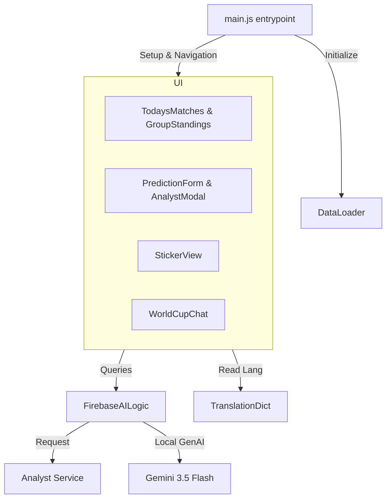

# World Cup App Frontend (`src/`)

This directory houses the client-side single-page application built on **Vite**, utilizing **vanilla ES modules**, **Three.js** (for WebGL effects), and **Tailwind CSS**.

---

## Architectural Layout

The application follows a modular MVC-style component design:



---

## Folder Structure

*   **`domain/`**: Core domain entities — `Team`, `Match`, `Sticker`, `Prediction`.
*   **`infrastructure/`**: External adapters and cross-cutting concerns:
    *   **`ai/`**: `FirebaseAILogic.js` — Gemini & Analyst Microservice client. `WinnerAnimationTrigger.js` — triggers 3D flag animation on analysis completion.
    *   **`db/`**: `DataLoader.js` — parses local JSON match and stadium data.
    *   **`lang/`**: `TranslationDict.js` and `LocalizationService.js` — English/Spanish i18n engine.
    *   **`media/`**: `CameraService.js` — webcam capture for sticker photo input.
    *   **`search/`**: `NLPQueryParser.js` — natural language query parsing.
    *   **`utils/`**: `TimezoneUtil.js` — browser timezone conversion helpers.
    *   **`AppConfig.js`**: Centralized environment-based configuration (Firebase, service URLs).
*   **`resources/`**: Static assets and canvas utilities:
    *   **`StickerCardRenderer.js`**: Canvas rendering engine for the holographic player card template.
    *   **`translations.json`**: Compact base translation strings.
*   **`ui/`**: User interface code:
    *   **`animations/`**: Three.js WebGL rendering for the interactive 3D hero intro.
    *   **`components/`**: Layout panels (chat, standings, today's games, predictions form).
    *   **`views/`**: Complex view aggregates like the Sticker Generator.
    *   **`index.css`**: Premium styling, custom scrollbars, and stadium spotlights.

---

## Multi-Language Architecture

The application implements a real-time reactive translation engine:

1.  **Selection Hook**: Clicking language buttons in the header changes the document language root:
    ```javascript
    document.documentElement.lang = 'en'; // or 'es'
    ```
2.  **UI Sync**: `updateLanguageUI()` in `main.js` translates static HTML templates directly using `TranslationDict.js`.
3.  **Dynamic Rendering**: Component `render()` calls are invoked instantly, fetching localized text schemas:
    ```javascript
    const lang = document.documentElement.lang || 'es';
    const dict = TRANSLATIONS[lang];
    ```
4.  **Localized AI Prompts**: Prompts sent to Gemini or the Sequential Agent (e.g. system instructions, visual card style details) are formatted dynamically based on `lang`, ensuring both generated images/stickers and text responses adapt to the user's chosen language.
