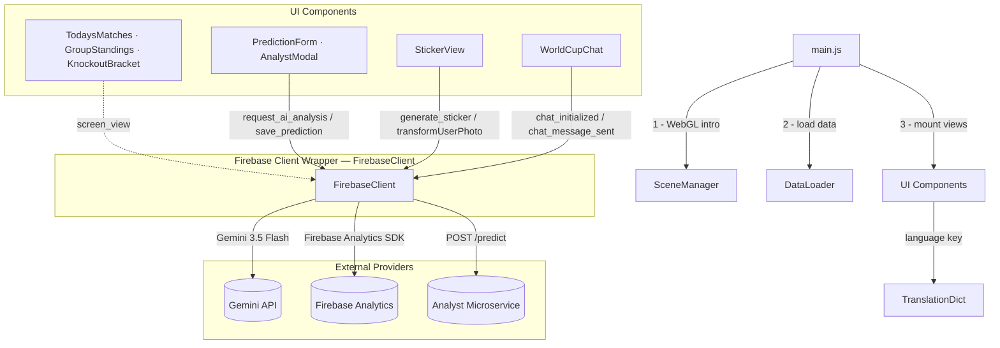

# ⚽ World Cup App — Frontend

Client-side Single-Page Application built with **Vite** + **Vanilla ES Modules**, **Three.js** (WebGL hero intro), **GSAP** (animations), and **Tailwind CSS**. All Firebase features (Gemini AI, Chat, Image editing, and Analytics tracking) flow through **FirebaseClient**.

---

## Architecture

The app follows a **Clean Architecture** layout separating domain logic, infrastructure adapters, and UI rendering. `main.js` is the single bootstrap entrypoint — it initializes the 3D hero, loads data, and mounts all view components.



---

## Folder Structure

```
src/
├── domain/                     # Core business entities (no dependencies)
│   └── entities/
│       ├── Match.js            # Match data model
│       ├── Team.js             # Team + GroupStanding calculations
│       ├── Sticker.js          # Player sticker model & stats
│       └── Prediction.js       # AI analysis response model
│
├── infrastructure/             # External adapters & cross-cutting concerns
│   ├── firebase/
│   │   └── FirebaseClient.js   # All Firebase SDK hooks: Analytics logging, Chat, & Image Gen
│   ├── ai/
│   │   └── WinnerAnimationTrigger.js # Triggers WebGL flag animation on AI result
│   ├── db/
│   │   └── DataLoader.js       # Fetches local JSON: groups, matches, stadiums
│   ├── lang/
│   │   ├── TranslationDict.js  # Full ES/EN translation map
│   │   └── LocalizationService.js  # Stateful language switcher helper
│   ├── media/
│   │   └── CameraService.js    # Webcam access (getUserMedia) for sticker photo
│   ├── search/
│   │   └── NLPQueryParser.js   # Natural language query parser & conversational fallback
│   ├── utils/
│   │   └── TimezoneUtil.js     # Converts UTC match times to local browser timezone
│   └── AppConfig.js            # Reads VITE_ env vars: Firebase keys, service URL
│
├── resources/                  # Static helpers loaded at runtime
│   ├── StickerCardRenderer.js  # Canvas 2D renderer for the holographic player card
│   └── translations.json       # Compact fallback translation strings
│
├── ui/
│   ├── animations/             # Three.js / GSAP WebGL layer
│   │   ├── SceneManager.js     # Orchestrates the WebGL scene lifecycle
│   │   ├── SoccerBallHero.js   # Soccer ball entry with tactical grid, energy core, and impact shake
│   │   ├── FlagFactory.js      # Builds waving flag meshes with SVG textures
│   │   ├── CameraTransitions.js # GSAP camera pan across bracket stages
│   │   ├── InteractionManager.js # Bridges DOM events to WebGL triggers
│   │   ├── LoopOptimizer.js    # RAF-based render loop with pause/resume
│   │   └── StickerCardPreview.js # WebGL sticker card preview mesh
│   ├── components/             # Self-contained UI panels (render + event bind)
│   │   ├── GroupStandings.js   # 12-group standings tables (with scroll-controlled responsive modals)
│   │   ├── KnockoutBracket.js  # Full knockout bracket (with responsive match details modals)
│   │   ├── TodaysMatches.js    # Today's match carousel with local times
│   │   ├── PredictionForm.js   # Match selector with mobile-responsive header constraints
│   │   ├── AnalystModal.js     # Modal displaying AI prediction results, bottom sheets, & charts
│   │   ├── WorldCupChat.js     # Chat assistant panel featuring suggestion chips and responsive height
│   │   ├── SearchBar.js        # Chat input bar
│   │   ├── SearchResults.js    # Chat results renderer
│   │   └── WebGLCanvas.js      # Canvas mount helper
│   ├── views/                  # Full-page view aggregates
│   │   └── StickerView.js      # Sticker generator: form + camera + canvas preview
│   └── index.css               # Global styles, glassmorphism, spotlight FX, and viewport-lock fixes
│
└── main.js                     # Bootstrap: hero → loadData → mount components
```

---

## Analytics Events

The application uses Firebase Analytics to monitor user engagement. The following events are fired automatically:

| Event Name | Fired When | Parameters |
|---|---|---|
| `screen_view` | User clicks tab to navigate views | `screen_name`, `screen_class` |
| `request_ai_analysis` | User clicks prediction button | `match_id`, `home_team`, `away_team` |
| `save_prediction` | User saves a score prediction | `match_id`, `prediction` |
| `generate_sticker` | User requests card image generation | `team`, `position` |
| `chat_initialized` | WorldCupChat screen renders | None |
| `chat_message_sent` | User submits text query to Chat | `mode` (`sdk` or `fallback`) |
| `stadium_query` | User queries stadium capacity | `stadium` |
| `stadium_matches_query` | User queries matches played in stadium | `stadium` |
| `conversational_search` | NLP falls back to Conversational Agent | `query` |

---

## Multi-Language Engine

Real-time ES ↔ EN switcher — no page reload required.

```
User clicks flag button
    → document.documentElement.lang = 'en' | 'es'
    → updateLanguageUI() in main.js
        → reads TRANSLATIONS[lang] from TranslationDict.js
        → patches static HTML text nodes
        → calls render() on every mounted component
            → components re-render with localized strings
            → FirebaseClient rebuilds system prompts in the new language
```

All Gemini prompts (chat system instruction, sticker card style, analyst language) are rebuilt dynamically on language switch — so AI responses also adapt to the selected language.

---

## Key Conventions

| Convention | Rule |
|---|---|
| **File naming** | `PascalCase.js` for all classes and modules |
| **Exports** | One class per file, named export matching filename |
| **No framework** | Vanilla ES Modules only — no React/Vue/Svelte |
| **Env vars** | All secrets via `VITE_*` variables, read only in `AppConfig.js` |
| **Central Service** | All Firebase and Analytics interactions are unified in `FirebaseClient.js` |
